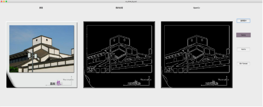
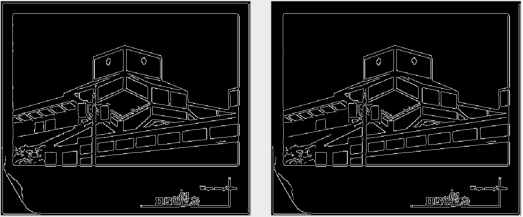
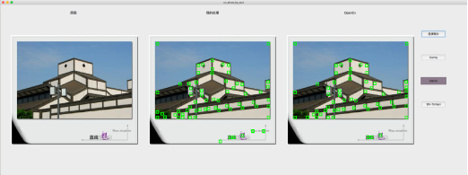
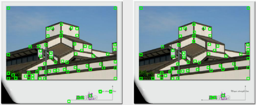
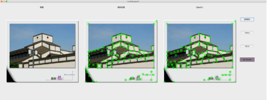
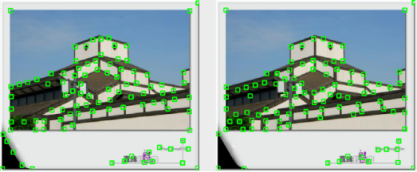

## Canny边缘检测
参数：
>`lowThreshold = 50, highThreshold = 100`  

  

左：自己实现， 右：OpenCv库

 

## Harrisi角点检测
参数：
>`qualityLevel = 0.01, blockSize = 20, ksize = 3, k = 0.05` 
  
  

左：自己实现， 右：OpenCv库

 

## Shi-Tomasi角点检测
参数：
>`maxCorners = 100, qualityLevel = 0.01, minDistance = 20, blockSize = 5` 
  
  

左：自己实现， 右：OpenCv库

 